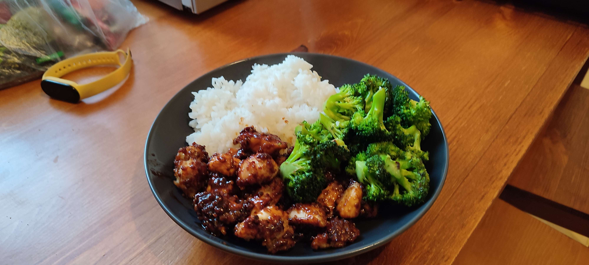

# Kuracie prsia s brokolicou a medovou omáčkou

---

## Ingrediencie

### Mäso
- Ryža jasmínová – 300 g
- Kuracie prsia - 600 - 800 g
- Strúhanka – 100 g
- Olej (Môže byť aj olivový) – 2 PL
- Soľ – za hrsť
- Korenie čierne mleté - za hrsť

### Brokolica
- Brokolica
- Olej na smazenie
- Soľ – za hrsť
- Korenie čierne mleté - za hrsť

### Omáčka

- 1 PL oleja (Najlepšie sezamového)
- 1 PL strúhaného cesnaku
- 2 strúčky cesnaku (Rozdrteného)
- 3 PL medu
- 3 PL sojovej omáčky
- 5 PL vody + 2 PL vody (Na zahustenie)
- 1 PL chilli pasty
- 1 PL octa
- 2 PL hnedého cukru
- 1 PL skrobu

---

## Náradie (voliteľné)

- Miska na miešanie
- Panvica na vyprážanie
- Trúba na pečenie
- Pekáč

---

## Postup

### Mäso
1. Nakrájame mäso na menšie kocky a dáme ich do misky.
2. Nakrájané mäso v miske osolíme, okoreníme a pridáme strúhanku, olej a dobre premiešame.
3. Mäso naukladáme na pečúci papier na pekáči a dáme piecť do predhriatej rúry na **180 stupnov** na **30 minút**.

### Brokolica
1. Umyjeme a nakrájame brokolicu na menšie kúsky, spolu s tým aj stopku brokolice.
2. Rozohrejeme olej na panvici pridáme brokolicu a smažíme do hneda. Nakoniec osolíme a okoreníme.

### Omáčka
1. Pripravíme si cesnak a zázvor.
2. Do kastróla si pridáme 5PL vody a pridáme med, sojovú omáčku, chilli pastu, ocot, hnedý cukor, cesnak a zázvor.
3. Dáme na šporák a začneme variť a miešať. Keď omáčka dojde do bodu varu, rozmiešame si škrob v 2 PL vody, a pridáme do omáčky.
4. Miešame pokiaľ nám omáčka nezhustne.